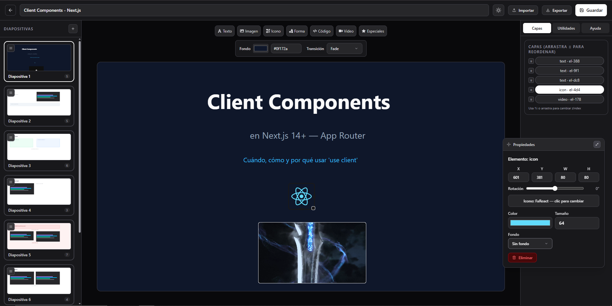

<h1 align="center">
  LivePresentations
</h1>

<p align="center">
  
  
  
  
  
  
  
  
  
</p>

<p align="center">
  
</p>

LivePresentations es una plataforma para crear, presentar y controlar diapositivas en tiempo real desde el móvil. Editor visual con canvas arrastrable, salas con QR y WebSocket, modo presentador/controlador, preguntas interactivas, variables de proyecto y exportación/importación de presentaciones.

---

## Funcionalidades

- **Dashboard** para crear y organizar presentaciones, generar salas con código y QR, ver salas activas y unirse como controlador escaneando el QR.
- **Editor visual** con lienzo 1280×720 donde puedes arrastrar, redimensionar, rotar y reordenar capas; añade texto con múltiples tipografías y fondo opcional, imágenes, formas, vídeos de archivo o YouTube, iconos y bloques de código con resaltado.
- **Preguntas interactivas** con un bloque especial configurable: elige el texto y los colores del bloque y define la pregunta, sus respuestas y hasta dos bloques de código adicionales.
- **Sorteo de participantes** usando una lista de nombres guardada como variable; elige al azar con un recuadro deslizante o una ruleta animada, configura la duración del giro y decide si el nombre sorteado se descarta para no repetirse mientras dure la presentación.
- **Preguntas y respuestas** totalmente personalizables: escribe la pregunta y elige su color y alineación, define cuántas respuestas mostrar (de 2 a 6), el formato (letras A-D, números 1-4 o texto libre), el texto de cada opción y cuál es la correcta.
- **Variables del proyecto** reutilizables en toda la presentación: crea variables numéricas, de texto, verdadero/falso, listas y objetos con validación del contenido y úsalas para alimentar sorteos u otros contenidos.
- **Salas configurables** al crearlas: decide si se muestran los controles de navegación, si la presentación ocupa toda la pantalla, si aparece una pantalla anti-spoiler con cuenta regresiva al inicio y si el navegador entra automáticamente en pantalla completa al presentar.
- **Presentación en vivo** con dos vistas sincronizadas: el presentador ve la diapositiva actual y el controlador cambia de diapositiva, resalta elementos, lanza animaciones, expande bloques de código con líneas resaltadas y controla toda la dinámica de preguntas desde el móvil.
- **Pantalla completa sin bordes** que adapta automáticamente el tamaño y la posición de todos los elementos al tamaño de la ventana, sin franjas negras.
- **Exportar e importar** presentaciones completas como archivo `.zip` que incluye la información general, cada diapositiva por separado, las variables y todos los archivos subidos, además de soporte para el formato `.json` anterior.
- **Tema claro y oscuro** conmutables en toda la interfaz.

---

## Arquitectura

Monorepo `apps/frontend` + `apps/backend` con arquitectura por features. Frontend `React 19 + TypeScript + Vite + Tailwind 4 + Framer Motion + Zustand` bajo `src/features/` (`editor/`, `player/`, `room/`) y componentes base en `src/components/ui/` (`Button`, `Modal`, `Select`, `Checkbox`, `CodeBlock`). Estado de sala en `useRoom` y datos de presentación validados con `zod` (`presentationDataSchema`). Backend `FastAPI + SQLAlchemy 2.0 (async) + aiosqlite + Uvicorn` con `app/api/routes/` (`presentations`, `rooms`, `uploads`), `app/services/presentation_package.py` para zip, `app/ws/` para broadcast genérico `SPECIALS_*/ELEMENT_*/CUSTOM_*` sin tocar backend por cada nuevo elemento, y SQLite en `instance/livepresentations.db`. Sin store externo en frontend salvo `zustand` para `auth`/`theme`.

---

## Requisitos

- Node 18+
- Python 3.10+

---

## Instalación

Clona el repositorio:

```bash
git clone https://github.com/Zerik-Official/LivePresentations
cd LivePresentations
```

### Frontend

```bash
cd apps/frontend
npm install
```

### Backend

**Windows:**

```bash
cd apps/backend

# Entorno virtual
python -m venv venv
venv\Scripts\activate

# Dependencias
pip install -r requirements.txt

# Variables de entorno
copy .env.example .env
```

**Linux / macOS:**

```bash
cd apps/backend

python3 -m venv venv
source venv/bin/activate

pip install -r requirements.txt

cp .env.example .env
```

---

## Ejecución

> Para local y presentación en red, **conecta presentador y controlador a la misma red** para la comunicación en tiempo real vía WebSocket.

### Frontend (Vite) — recomendado con `--host`

```bash
cd apps/frontend
npm run dev -- --host
```

Disponible en `http://localhost:5173` y en `http://<tu-ip>:5173` para el móvil.

### Backend (Uvicorn) — recomendado con `--host 0.0.0.0`

```bash
# desde la raíz del repo
uvicorn app.main:app --host 0.0.0.0 --port 8000 --app-dir apps/backend --reload
```

API en `http://localhost:8000`, docs en `http://localhost:8000/docs`, WebSocket en `/ws/room/{code}`.

En desarrollo el frontend hace proxy a `http://localhost:8000`. En escritorio puedes abrir `http://<tu-ip>:8000/docs` para probar.

### Build de producción

```bash
cd apps/frontend
npm run build
```

Genera `dist/` listo para servir.

---